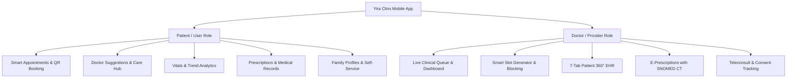
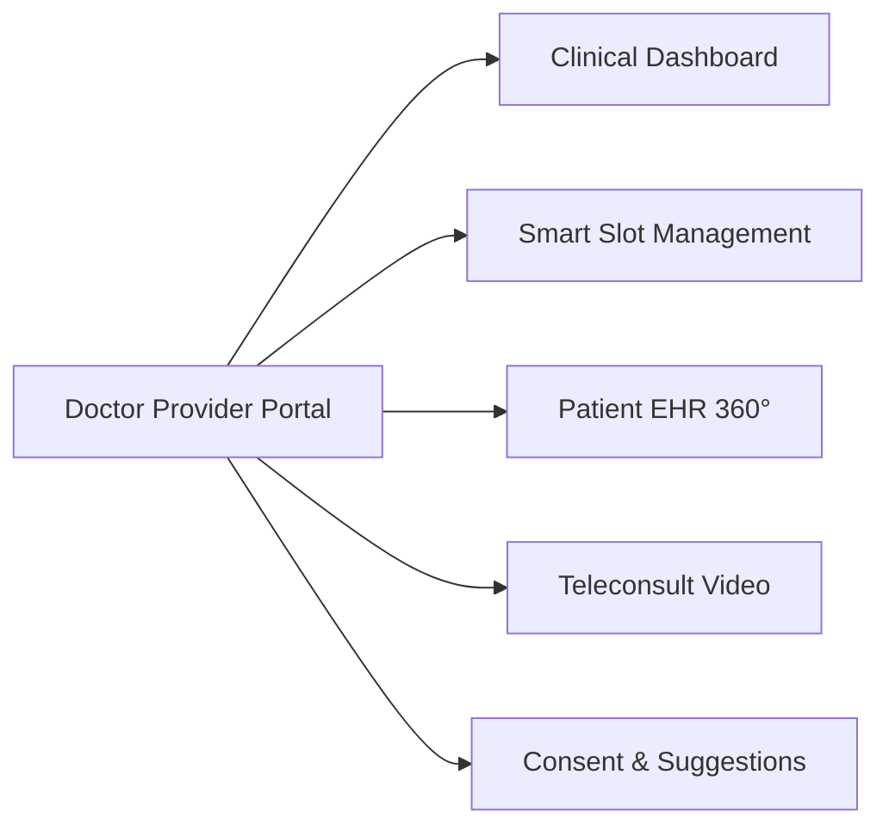

# Yira Clinx — Complete Roles & Features Documentation

**Version:** 2.0.0 (Build 2)  
**Platform:** Flutter Mobile (iOS & Android) & Node.js/TypeScript Backend  
**Backend API:** `https://clinicx-api-qa.azurewebsites.net`  

---

## 📑 Table of Contents
1. [Executive Summary](#1-executive-summary)
2. [Role 1: Patient / User Role](#2-role-1-patient--user-role)
   - [2.1 Authentication & Onboarding](#21-authentication--onboarding)
   - [2.2 Patient Dashboard & Quick Services](#22-patient-dashboard--quick-services)
   - [2.3 Appointment Discovery & Booking](#23-appointment-discovery--booking)
   - [2.4 Doctor Suggestions & Care Guidance](#24-doctor-suggestions--care-guidance)
   - [2.5 Health Vitals Tracking & Visualization](#25-health-vitals-tracking--visualization)
   - [2.6 Medical Records & Diagnostic Documents](#26-medical-records--diagnostic-documents)
   - [2.7 Digital Prescriptions](#27-digital-prescriptions)
   - [2.8 Family & Dependent Management](#28-family--dependent-management)
   - [2.9 Self-Service & Digital Consents](#29-self-service--digital-consents)
3. [Role 2: Doctor / Healthcare Provider Role](#3-role-2-doctor--healthcare-provider-role)
   - [3.1 Provider Dashboard & Clinical Queue](#31-provider-dashboard--clinical-queue)
   - [3.2 Smart Slot Scheduler & Availability Management](#32-smart-slot-scheduler--availability-management)
   - [3.3 Patient Management & 360° EHR Profile](#33-patient-management--360-ehr-profile)
   - [3.4 E-Prescriptions & SNOMED CT Engine](#34-e-prescriptions--snomed-ct-engine)
   - [3.5 Clinical Progress Notes (SOAP)](#35-clinical-progress-notes-soap)
   - [3.6 Doctor Suggestions Publishing](#36-doctor-suggestions-publishing)
   - [3.7 Patient Access Consent & Privacy Tracking](#37-patient-access-consent--privacy-tracking)
   - [3.8 Online Video Consultations (Telehealth)](#38-online-video-consultations-telehealth)
   - [3.9 Doctor Profile & QR Connect](#39-doctor-profile--qr-connect)
4. [Cross-Role Architecture & Shared Capabilities](#4-cross-role-architecture--shared-capabilities)
   - [4.1 Real-Time Push Notification Engine](#41-real-time-push-notification-engine)
   - [4.2 Cloud Storage & Security](#42-cloud-storage--security)
   - [4.3 Role Switcher & Family Account Sync](#43-role-switcher--family-account-sync)

---

## 1. Executive Summary

**Yira Clinx** is a full-stack digital healthcare and clinical management ecosystem designed to bridge communication between patients and healthcare providers. The mobile application delivers specialized experiences tailored to two primary personas:

---

## 2. Role 1: Patient / User Role

The Patient interface empowers users to manage their personal and family healthcare journeys seamlessly from appointment booking to ongoing post-consultation care.

### 2.1 Authentication & Onboarding
* **Phone OTP & Password Login:** Fast, passwordless login with SMS OTP verification or credential-based login.
* **Interactive Guided Tours:** Step-by-step feature highlights for first-time users explaining Quick Services, Appointments, and Vitals.
* **Hospital / Clinic Association:** Select or switch primary hospitals, liked clinics, and attending doctor networks.

### 2.2 Patient Dashboard & Quick Services
* **Health Overview Hub:** Displays greeting, active hospital context, latest announcements, and vital stats.
* **Upcoming Appointments Carousel:** Instant view of upcoming visits with doctor details, clinic address, time, and consultation type (In-Person / Video).
* **6-Grid Quick Services Hub:**
  1. **Book Appointment:** Quick entry to multi-specialist booking.
  2. **Medical Records:** Access to lab reports, discharge summaries, and uploaded scans.
  3. **My Vitals:** Interactive graphs tracking vital trends.
  4. **My Doctors:** List of saved and scanned doctors for rapid rebooking.
  5. **My Family:** Manage dependent profiles and switch active context.
  6. **Doctor Suggestions:** Direct access to doctor care instructions and advice.

### 2.3 Appointment Discovery & Booking
* **Multiple Discovery Channels:**
  * **By Hospital:** Select a hospital to view departments and doctors.
  * **By QR Scan:** Scan a doctor's personal clinic QR code to open their booking calendar instantly.
  * **By Specialty:** Filter specialists by cardiology, pediatrics, general medicine, etc.
* **Smart Slot Selector:**
  * Morning, afternoon, and evening slot segregation.
  * Live status indicators (Available, Booked, Blocked, Past).
  * Automatic past-slot filtering for today's date.
  * Out-of-slot / walk-in booking support for verified emergency visits.

### 2.4 Doctor Suggestions & Care Guidance
* **Dedicated Suggestions Hub:** Full-screen interface showing personalized advice provided by consulting doctors.
* **Category Filters:** Filter by *Lifestyle, Diet & Nutrition, Medication, Exercise, Follow-up,* or *General Advice*.
* **Full-Text Search:** Real-time search by doctor name, title, or recommendation keywords.
* **Cloud Document Viewer:** One-tap opening of attached PDF meal plans, exercise guides, and care instructions hosted on Azure Blob Storage.
* **Interactive Detail Sheet:** Full instruction viewer with a 1-tap **"Consult Doctor"** action to schedule follow-ups.

### 2.5 Health Vitals Tracking & Visualization
* **Tracked Metrics:** Blood Pressure (Systolic/Diastolic), Heart Rate (BPM), SpO2 (%), Temperature (°F/°C), and Weight (kg).
* **Interactive Syncfusion Graphs:** High-performance trend charts with spline curves, normal range markers, and tooltips.
* **Time Range Filtering:** Filter trends by *Today, 7 Days,* or *Custom Date Range*.
* **Vitals History & Logger:** Manual entry bottom sheet to record daily readings with instant chart refresh.

### 2.6 Medical Records & Diagnostic Documents
* **Secure Vault:** Categorized storage for lab reports, radiology images, prescriptions, and test results.
* **Document Ingestion:** Upload records via camera, document picker, or secure web upload links (`uploadDocumentsViaLink`).
* **Document Viewer:** Built-in viewer with external launcher support for high-resolution inspection.

### 2.7 Digital Prescriptions
* **Active & Past Prescriptions:** Chronological list of doctor-prescribed medications.
* **Prescription Details:**
  * Medication names, dosages, and administration frequencies (e.g. 1-0-1 after food).
  * Duration in days and special instructions.
  * Associated diagnosis and doctor signatures.

### 2.8 Family & Dependent Management
* **Multi-Profile Management:** Add dependents (children, spouse, parents) under a single primary account.
* **Context Switching:** Seamlessly switch active family profile to book appointments, review vitals, or view prescriptions on behalf of family members.
* **Synced Notifications:** Family heads automatically receive booking and reminder alerts for all dependent consultations.

### 2.9 Self-Service & Digital Consents
* **Digital Consent Signing:** Review hospital consent forms and submit legal digital e-signatures (`digitalConsentSign`).
* **Online Bill Payment:** Secure in-app payment gateway integration for consultation fees and hospital dues (`onlineBillPayment`).
* **Consultation Summaries:** Review post-visit doctor summaries, diagnosis, and action plans (`viewConsultationSummary`).

---

## 3. Role 2: Doctor / Healthcare Provider Role

The Provider interface serves as a comprehensive clinical operating system enabling doctors to manage patient flow, conduct consultations, issue prescriptions, and maintain electronic health records (EHR).

### 3.1 Provider Dashboard & Clinical Queue
* **Daily Schedule & Live Queue:** Real-time counter of today's appointments categorized by status: *Scheduled, In-Progress, Completed, Cancelled*.
* **Patient Quick Metrics:** Total patients seen, upcoming video consults, and pending reports.
* **Favorite Patients Bar:** Star-tag critical or frequent patients for 1-tap EHR access.
* **Quick Action Toolbar:** + New Appointment, Patient Directory, Slot Scheduler, and Rx List.

### 3.2 Smart Slot Scheduler & Availability Management
* **Slot Deployment Engine:** Generate consultation time slots with customizable session lengths (e.g., 10m, 15m, 30m).
* **Flexible Slot Blocking:**
  * Block specific slots for surgery, meetings, or personal breaks.
  * Reason tagging (e.g., "Emergency", "Break", "Personal").
* **Gap Logic & Buffer Time:** Configurable interval gaps between consecutive appointments to prevent clinic delays.

### 3.3 Patient Management & 360° EHR Profile
The core clinical workstation features a **7-tab comprehensive patient record**:

| Tab | Feature & Clinical Capability |
| :--- | :--- |
| **1. Info** | Demographics, emergency contacts, blood group, vital baseline, and registration details. |
| **2. Appointments** | Complete past and upcoming visit history, consultation types, and statuses. |
| **3. Medical Record** | Lab reports, pathology scans, diagnostic imaging, and external documents. |
| **4. Prescribe** | Digital prescription history, active drug courses, and issuance engine. |
| **5. Notes** | SOAP clinical progress notes, doctor observations, and physical examination records. |
| **6. Documents** | Signed digital consents, post-visit documentation, and billing receipts. |
| **7. Suggestions** | Care instructions, diet plans, and health tips published to the patient. |

### 3.4 E-Prescriptions & SNOMED CT Engine
* **Standardized Medical Terminology:** Integrated **SNOMED CT** search for diagnoses, symptoms, and clinical findings.
* **Structured Medication Studio:**
  * Medicine search with brand and generic names.
  * Dosage configuration (Morning / Afternoon / Evening / Night).
  * Food intake timing (Before / After meals).
  * Treatment duration (Days / Weeks) and refill authorizations.

### 3.5 Clinical Progress Notes (SOAP)
* **Structured Clinical Documentation:** Record Subjective, Objective, Assessment, and Plan (SOAP) notes during or after consultations.
* **File Attachments:** Attach diagnostic images or handwritten notes with Azure Blob cloud synchronization.

### 3.6 Doctor Suggestions Publishing
* **Care Plan Delivery:** Doctors can send structured advice directly to a patient's mobile app.
* **Attachment Support:** Upload PDF diet charts, exercise routine sheets, or rehabilitation guides.
* **Instant Alert:** Triggers an automated high-priority push notification to the patient upon submission.

### 3.7 Patient Access Consent & Privacy Tracking
* **Consent Request Flow:** Request authorization from patients to access sensitive medical history.
* **Status Monitoring:** Track real-time status: *Pending, Approved, Expired, Revoked*.
* **HIPAA/Digital Privacy Compliance:** Strict server-side verification ensuring doctors only access records with active consent.

### 3.8 Online Video Consultations (Telehealth)
* **Integrated Teleconsultation Room:** High-quality audio/video consultation capability within the mobile app.
* **Meeting Redirection & Readiness:** One-tap "Start Consultation" triggers a push notification to the patient with a direct join link.

### 3.9 Doctor Profile & QR Connect
* **Public Doctor Profile:** Specialization, educational qualifications, clinic locations, and consultation fees.
* **Personalized QR Code:** High-resolution QR code generator for clinic reception displays; allows walk-in patients to scan and instantly connect with the doctor.

---

## 4. Cross-Role Architecture & Shared Capabilities

### 4.1 Real-Time Push Notification Engine
Notifications are managed through a centralized multi-device dispatcher utilizing Firebase Cloud Messaging (FCM) and SQL persistence:

| Event Trigger | Recipient | Action / Deep-Link Route |
| :--- | :--- | :--- |
| **Appointment Booked** | Doctor & Patient (+ Parent) | `/doctorDashboard` / `/patientDashboard` |
| **10-Min Pre-Visit Reminder** | Doctor & Patient | 10 mins before slot; automated cron trigger |
| **New Prescription Issued** | Patient | `/userPrescriptionManagement` |
| **Doctor Suggestion Added** | Patient | `/patientDoctorSuggestions` |
| **Medical Record / Note Added**| Patient | `/userTestResultScreen` |
| **Appointment Status Updated** | Patient | Live status reflection |
| **Teleconsult Room Ready** | Patient | One-tap video room redirect |

### 4.2 Cloud Storage & Security
* **Azure Blob Storage:** Secure, high-speed encrypted storage for medical records, consent signatures, and suggestion attachments.
* **Role-Based Access Control (RBAC):** Backend JWT token verification with granular permissions per role.

### 4.3 Role Switcher & Family Account Sync
* **Dual-Role Support:** Users with both doctor and patient profiles can toggle between interfaces in 1 tap without logging out.
* **Adaptive Theming:** System-wide **Dark Mode** and **Light Mode** styling adhering to the Yira design aesthetic (`appPoppinFont`, vibrant gradients, and responsive layouts).

***

*Documentation prepared for engineering, product, QA, and executive leadership teams.*
